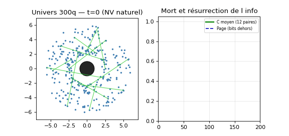
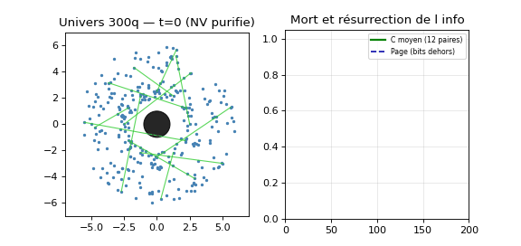

# ⚛️ RATISS-QVM — l'ordinateur quantique virtuel (la symbiose)

**Fidélité Google-qsim + puissance Qiskit-Aer + architecture synchrotron-24
+ outils RATISS-QPU-AMBIENT. Un repo, une symbiose.** MIT.

## 🎬 L'EFFET : mort et résurrection de l'intrication (N=300, trou noir)

12 paires de Bell à cheval sur l'horizon, évaporation S02 : la concurrence
**meurt (C→0.00)** quand le partenaire tombe, puis **ressuscite (C→0.63)**
à la réémission — la courbe de Page QUANTIQUE, avec les bits (P : 1→0.03→0.78).

|  |  |
|---|---|
| NV naturel : la résurrection **meurt** (fin 0.02, bain ¹³C) | ¹²C purifié : elle **survit** (fin 0.32) |

La qualité du PROCESSEUR (T2 Jarmola, `ratiss_qpu/coherence`) est visible
dans l'univers. Portes appliquées en direct : `U.gate('h', q)`, `U.cx(a, b)`,
`U.bell(a, b)`, mesure Born. Lois S01/S02 intactes (rien supprimé).

```bash
pip install -e .                    # + qsimcirq (optionnel, vitesse Google)
python3 demos/effet_horizon.py      # naturel (NV T2=1ms)
python3 demos/effet_horizon.py --nv purifie   # ¹²C (T2→10ms, cap 2·T1)
```

## 🖥️ Les jumeaux : vrais backends Qiskit (Kingston/Marrakesh)

`TwinBackend('kingston')` : transpile + run comme un QPU cloud, bruit calibré
sur NOS moissons IBM (cprops T1/T2/readout mesurées + 1 bouton p2q effectif,
fit train λ={0.4,0.8,1.2,1.6}, **testé sur {0.6,1.0,1.4}**) :

| Jumeau | p2q | Test (prédit vs réel IBM) | Verdict |
|---|---|---|---|
| Kingston | 0.015 | 0.127/0.142, 0.192/0.214, 0.232/0.217 | ✅ err ~0.017 |
| Marrakesh | 0.05 | 0.074/0.069, 0.112/0.125, 0.130/0.144 | ✅ err ~0.010 |

p2q(M)/p2q(K) = 3.3× : **l'extra style-M quantifié** (cf dose-10/D4).
T2>T1 snapshot (q31-K) clippé (tracé). Dérive 0.04 inter-session : roadmap.

```python
from rqvm import TwinBackend, pop, zz_contact
be = TwinBackend('kingston')
counts = be.run(pop(1.0), shots=2000).result().get_counts()
```

## 🧰 Contenu (rien supprimé)

- `rqvm/` : univers 300-1000q (`universe.py`), substrat quantique
  (`qsubstrate.py`), moteurs exact/Aer/qsim (`engines.py`), cellule 6q
  (`cell.py`), observables trio (`observables.py`), jumeaux (`twins.py`), CLI.
- `ratiss_qpu/` + `bench/` : outils AMBIENT (NV, Lindblad, banc virtuel...).
- `experiences/` + `organes/` : S01-S06 et lois synchrotron (archives vivantes).
- `demos/` : l'EFFET (GIF + JSON). `scripts/fit_twins.py` : calibration
  reproductible. `tests/` : 10 tests.

## ⚠️ Limites honnêtes (v1)

Paires de Bell uniquement (pas de GHZ-3+, documenté) ; déphasage gravité =
MODÈLE (KH, KH_HOLE calibrés pour l'effet, pas dérivés) ; p2q = effectif
(absorbe décomposition + dérive) ; NV→univers via constante normalisée.
