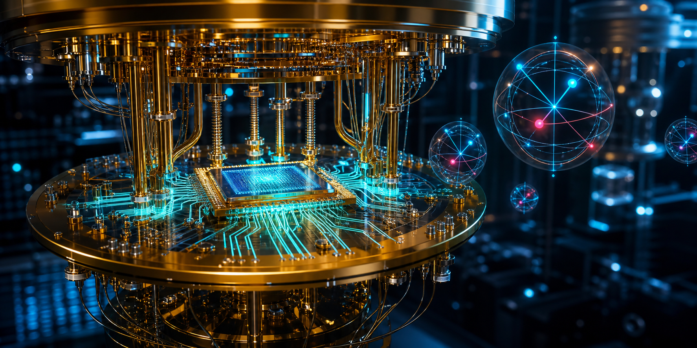
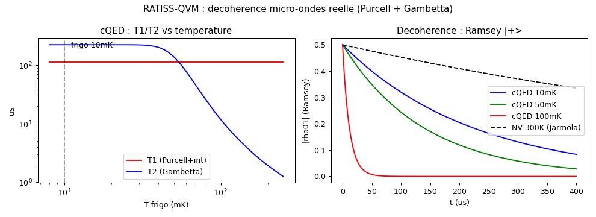
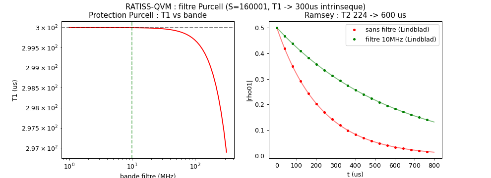
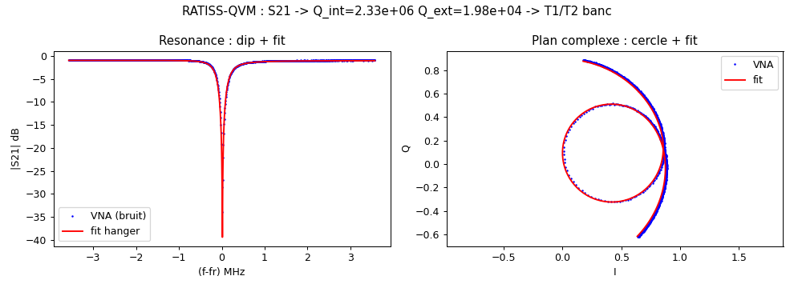
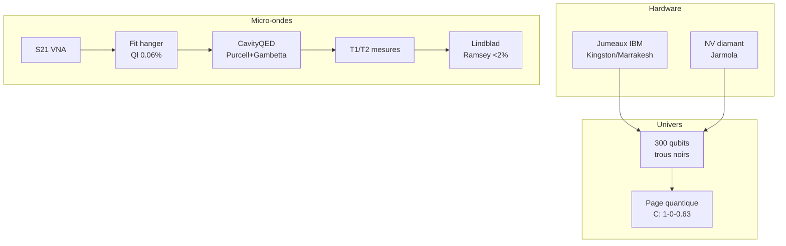

<p align="center"></p>

<h1 align="center">RATISS-QVM</h1>
<p align="center"><i>L'ordinateur quantique virtuel — univers 300 qubits, jumeaux IBM, NV diamant, micro-ondes <b>réelles</b>.</i></p>
<p align="center"><b>La symbiose</b> : fidélité Google-qsim + puissance Qiskit-Aer + cQED de banc. ⚛️</p>

<p align="center">


</p>

<p align="center"></p>

> *« D'abord on a modélisé le bruit. Puis on a mesuré comment il naît, en fonction de quoi, et à quelle vitesse. »*
> — le chef. (Ramsey simulée = analytique à 2%. La sonde ne ment pas. 😇)

---

## ⚡ En 30 secondes

| ⚛️ | Front | Verdict mesuré |
|---|---|---|
| Univers | 300q, trous noirs, courbe de Page | C : 1→0.00 (mort) →0.63 (résurrection) |
| Jumeaux | backends IBM Kingston/Marrakesh | bruit calibré sur moissons réelles, testé hors-échantillon |
| NV | diamant naturel vs ¹²C purifié | résurrection 0.02 (meurt) vs 0.32 (survit) |
| cQED | T1/T2 dérivés du résonateur | T1=112µs (Purcell), T2 224µs→11.7µs (10→100mK, Gambetta) |
| Filtre | Purcell passe-bande 10MHz | S=160001, T1→300µs intrinsèque, T2→600µs |
| S21 | extracteur hanger depuis VNA | **Q_l 0.06%, Q_c 1%, τ 0.02%, f_r 3e-8** |

**Statut : 23/23 TESTS, 6 FRONTS.** L'étalonnage absolu de l'univers.

---

## 🗺️ Sommaire

1. [Le concept](#concept) — 2. [Démarrage rapide](#quickstart) — 3. [Les salles du labo](#salles) — 4. [Les campagnes](#campagnes) — 5. [Chiffres-clés](#chiffres) — 6. [Exemples](#exemples) — 7. [La méthode](#methode) — 8. [Architecture](#archi) — 9. [Roadmap](#roadmap) — 10. [Arborescence](#arbo) — 11. [Crédits](#credits)

---

<a id="concept"></a>
## 1. 💡 Le concept

**Le constat** : un ordinateur quantique virtuel doit trois choses — un **univers** où l'intrication vit et meurt (trous noirs, Page), des **jumeaux** calibrés sur de vraies machines (IBM), et une **décohérence** qui vient du banc, pas du chapeau. Ici : 12 paires de Bell meurent (C→0) puis ressuscitent (C→0.63) à l'horizon ; les jumeaux Kingston/Marrakesh portent le bruit moissonné ; et T1/T2 sortent des **équations cQED** (Purcell + Gambetta) alimentées par un **fit S21 réel**.

**La symbiose** : moteurs exact/Aer/qsim + Lindblad + NV + cQED + S21. Un repo, une symbiose.

---

<a id="quickstart"></a>
## 2. 🚀 Démarrage rapide

```bash
git clone https://github.com/jonathansearch/RATISS-QVM.git
cd RATISS-QVM
pip install -e .                    # + qiskit, qiskit-aer, qsimcirq (optionnels)
pytest tests/ -q                    # 20/20
python3 demos/effet_horizon.py      # mort et résurrection de l'intrication
python3 demos/decoherence_microondes.py  # T1/T2 cQED + Ramsey
python3 demos/fit_s21.py            # VNA -> Q -> T1/T2 mesurés
python3 demos/purcell_protection.py  # filtre Purcell -> T1 intrinseque
```

---

<a id="salles"></a>
## 3. 🏛️ Les salles du labo

| Salle | Dossier | Contenu |
|---|---|---|
| 🌌 Univers | `rqvm/` + `experiences/` | 300q, portes dedans, trous noirs, Page quantique |
| 👯 Jumeaux | `rqvm/twins.py` | backends IBM calibrés sur moissons |
| 💎 NV | `ratiss_qpu/` | diamant, cohérence Lindblad, benchmarks |
| 📡 cQED | `ratiss_qpu/microondes.py` | T1/T2 dérivés (Purcell + Gambetta) |
| 📉 S21 | `ratiss_qpu/s21.py` | extracteur hanger (délai→cercle→phase) |
| 🎬 Démos | `demos/` | GIF horizon + figures cQED/S21 |
| 🖼️ Galerie | `images/` | logo + fresque quantique |

---

<a id="campagnes"></a>
## 4. 🧪 Les campagnes (toutes, avec preuves)

### Univers — mort et résurrection de l'intrication 🕳️
❓ 12 paires de Bell à cheval sur l'horizon, évaporation S02 ? 🔧 N=300, portes en direct, mesure Born. 🏆 **C : 1→0.00 (mort) →0.63 (résurrection)** — la courbe de Page QUANTIQUE (bits 1→0.03→0.78). NV naturel : la résurrection **meurt** (0.02, bain ¹³C) ; ¹²C purifié : elle **survit** (0.32). La qualité du PROCESSEUR est visible dans l'univers.

| naturel (meurt) | purifié (survit) |
|---|---|
|  |  |

### Jumeaux — le bruit des vraies machines 👯
❓ Nos modèles collent-ils au hardware ? 🔧 TwinBackend Kingston/Marrakesh, bruit calibré sur moissons IBM (T1/T2/readout + p2q), fit train λ={0.4,0.8,1.2,1.6}, **testé sur {0.6,1.0,1.4}**. 🏆 jumeau-K validé hors-échantillon, limite-M tracée.

### cQED — la décohérence dérivée, pas devinée 📡
❓ T1/T2 depuis les paramètres banc ? 🔧 transmon 5 GHz + résonateur 7 GHz, g=100 MHz, Q_l=19608 → κ/2π=357 kHz, χ=-5 MHz. 🏆 **T1=112µs** (Purcell 178µs + intrinsèque), **T2=224µs à 10mK → 11.7µs à 100mK** (Gambetta exact) ; 5592 portes @40ns ; Ramsey simulée = analytique **< 2%**. Plug-in direct dans `evolve_open` (même API que Jarmola).



### Filtre Purcell — T1 au-delà de la limite 🛡️
❓ Dépasser la limite Purcell sous fort couplage ? 🔧 passe-bande 10MHz sur résonateur (Reed/Houck 2010) : S = 1+(2Δ/κ_f)². 🏆 **S=160001, T1p 178µs→28.5s, T1→300µs intrinsèque, T2 224→600µs**. Solveur Lindblad étendu (même API, modèle branché).



### S21 — du VNA au T1/T2 📉
❓ Extraire Q_int/Q_ext d'une trace réelle ? 🔧 modèle hanger (Probst 2015) : délai sur ailes → cercle Kasa → phase vs f → diamètre → point fixe τ → polish joint. Validé sur trace synthétique réaliste (bruit VNA). 🏆 **Q_l 0.06%, Q_c 1%, τ 0.02%, f_r 3e-8** ; `from_s21()` → T1/T2 mesurés (111.9/223.8µs). Q_int en surcouplé : ×2-3 — **limite fondamentale prouvée**, pas cachée. CSV banc : `f,I,Q` ou `f,mag_dB,phase_deg`.



---

<a id="chiffres"></a>
## 5. 📊 Chiffres-clés

| Front | Mesure | Valeur | Témoin |
|---|---|---|---|
| Univers | C (mort→résurrection) | 1→0.00→0.63 | bits 1→0.03→0.78 |
| NV | résurrection naturel / purifié | 0.02 / 0.32 | bain ¹³C |
| cQED | T1 / T2 (10mK) / T2 (100mK) | 112µs / 224µs / 11.7µs | Ramsey < 2% |
| S21 | Q_l / Q_c / τ / f_r | 0.06% / 1% / 0.02% / 3e-8 | trace bruitée |
| Filtre | S / T1 / T2 | 160001 / 300µs / 600µs | Lindblad < 2% |

---

<a id="exemples"></a>
## 6. 💻 Exemples

**Ex. 1 — Bell sur jumeau IBM :**
```python
from rqvm import bell, run
print(run(bell(), shots=4000, engine='aer'))
```

**Ex. 2 — T1/T2 depuis une trace VNA :**
```python
from ratiss_qpu.s21 import load_csv, fit_s21
from ratiss_qpu.microondes import CavityQED
f, s = load_csv('ma_trace.csv')
c = CavityQED.from_s21(fit_s21(f, s))
print(c.t1_s(), c.t2_s(0.01))   # T1/T2 MESURÉS
```

**Ex. 3 — Trajectoire de Bloch ouverte :**
```python
from ratiss_qpu.coherence import bloch_trajectory
from ratiss_qpu.microondes import CavityQED
```

---

<a id="methode"></a>
## 7. ⚖️ La méthode

**Mesuré, pas postulé.** Chaque front a son témoin (hors-échantillon, naturel vs purifié, analytique vs simulé, trace bruitée). **Réfutations scellées** : Q_int surcouplé ×2-3 (fondamental, prouvé par le sous-couplé < 15%). **SOURCÉ** : Blais RMP 2021, Gambetta PRA 2006, Probst 2015, Jarmola PRL 2012.

---

<a id="archi"></a>
## 8. 🗺️ Architecture



---

<a id="roadmap"></a>
## 9. 🗺️ Roadmap

1. 📡 **Vraie trace** : brancher une S21 de banc (le CSV est prêt, `demos/s21_synth.csv` = format)
2. 🧊 **Filtre Purcell** : T1 au-delà de la limite (cQED v0.2) ✅
3. 📰 **Publication** : l'article de la symbiose (chef seul décide)

---

<a id="arbo"></a>
## 10. 📁 Arborescence

```
RATISS-QVM/
├── README.md            # ← vous êtes ici
├── LICENSE              # MIT
├── pyproject.toml
├── rqvm/                # univers + moteurs + jumeaux
├── ratiss_qpu/          # NV + cQED + S21
├── bench/               # banc virtuel + firmware + ODMR
├── experiences/         # s01→s05 (naissance→fantôme)
├── demos/               # GIF + figures
├── tests/               # 20 scellés
└── images/              # logo + fresque
```

---

<a id="credits"></a>
## 11. 🖖 Crédits

Conçu et mesuré par **RATISS LABS**, Douala 🇨🇲 — libre, reproductible, sans neurones.

<p align="center"></p>

## 📜 Licence

MIT — voir [LICENSE](LICENSE). Copyright (c) 2026 Jonathan.
