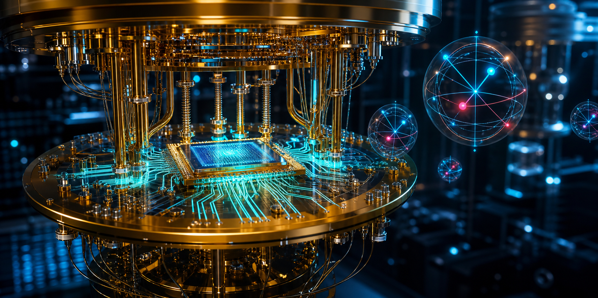
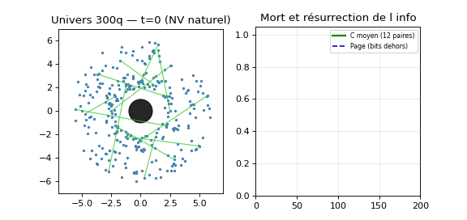
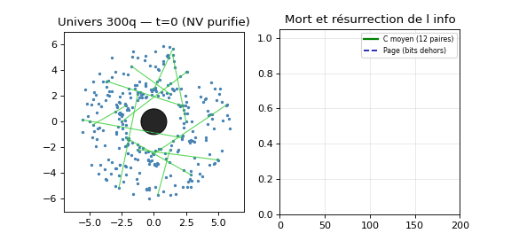
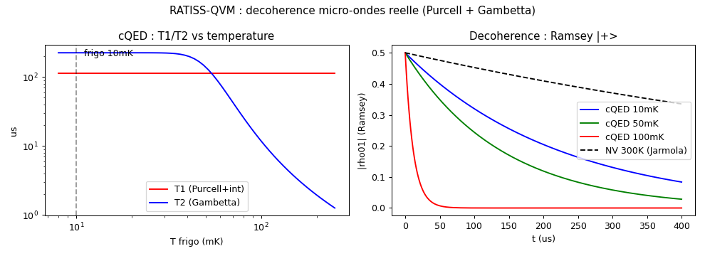
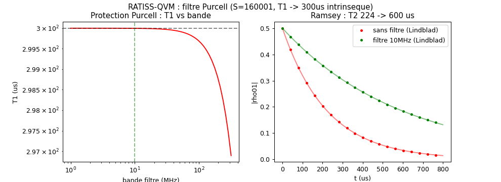
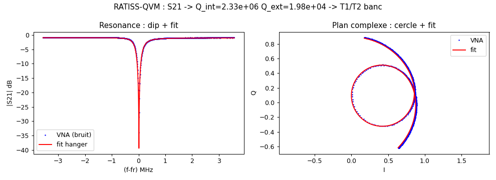
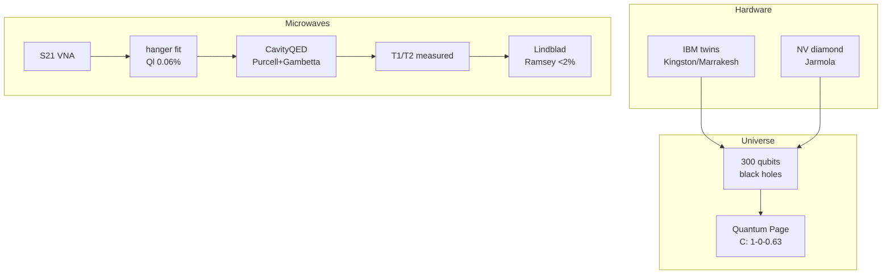

<p align="center"></p>

<h1 align="center">RATISS-QVM</h1>
<p align="center"><i>The virtual quantum computer — 300-qubit universe, IBM twins, NV diamond, <b>real</b> microwaves.</i></p>
<p align="center"><b>The symbiosis</b>: Google-qsim fidelity + Qiskit-Aer power + bench cQED. ⚛️</p>

<p align="center">


</p>

<p align="center"></p>

> *"First we modeled the noise. Then we measured how it is born, as a function of what, and at what speed."*
> — the chief. (Simulated Ramsey = analytical at 2%. The probe does not lie. 😇)

---

## ⚡ In 30 seconds

| ⚛️ | Front | Measured verdict |
|---|---|---|
| Universe | 300q, black holes, Page curve | C: 1→0.00 (death) →0.63 (resurrection) |
| Twins | IBM Kingston/Marrakesh backends | noise calibrated on real harvests, tested out-of-sample |
| NV | natural diamond vs purified ¹²C | resurrection 0.02 (dies) vs 0.32 (survives) |
| cQED | T1/T2 derived from the resonator | T1=112µs (Purcell), T2 224µs→11.7µs (10→100mK, Gambetta) |
| Filter | Purcell 10MHz band-pass | S=160001, T1→300µs intrinsic, T2→600µs |
| S21 | hanger extractor from VNA | **Q_l 0.06%, Q_c 1%, τ 0.02%, f_r 3e-8** |

**Status: 23/23 TESTS, 6 FRONTS.** The absolute calibration of the universe.

---

## 🗺️ Table of contents

1. [The concept](#concept) — 2. [Quick start](#quickstart) — 3. [The lab's rooms](#salles) — 4. [The campaigns](#campagnes) — 5. [Key numbers](#chiffres) — 6. [Examples](#exemples) — 7. [The method](#methode) — 8. [Architecture](#archi) — 9. [Roadmap](#roadmap) — 10. [Tree](#arbo) — 11. [Credits](#credits)

---

<a id="concept"></a>
## 1. 💡 The concept

**The observation**: a virtual quantum computer owes three things — a **universe** where entanglement lives and dies (black holes, Page), **twins** calibrated on real machines (IBM), and a **decoherence** that comes from the bench, not from a hat. Here: 12 Bell pairs die (C→0) then resurrect (C→0.63) at the horizon; the Kingston/Marrakesh twins carry the harvested noise; and T1/T2 come out of the **cQED equations** (Purcell + Gambetta) fed by a **real S21 fit**.

**The symbiosis**: exact/Aer/qsim engines + Lindblad + NV + cQED + S21. One repo, one symbiosis.

---

<a id="quickstart"></a>
## 2. 🚀 Quick start

```bash
git clone https://github.com/jonathansearch/RATISS-QVM.git
cd RATISS-QVM
pip install -e .                    # + qiskit, qiskit-aer, qsimcirq (optional)
pytest tests/ -q                    # 20/20
python3 demos/effet_horizon.py      # death and resurrection of entanglement
python3 demos/decoherence_microondes.py  # T1/T2 cQED + Ramsey
python3 demos/fit_s21.py            # VNA -> Q -> measured T1/T2
python3 demos/purcell_protection.py  # Purcell filter -> intrinsic T1
```

---

<a id="salles"></a>
## 3. 🏛️ The lab's rooms

| Room | Folder | Content |
|---|---|---|
| 🌌 Universe | `rqvm/` + `experiences/` | 300q, gates inside, black holes, quantum Page |
| 👯 Twins | `rqvm/twins.py` | IBM backends calibrated on harvests |
| 💎 NV | `ratiss_qpu/` | diamond, Lindblad coherence, benchmarks |
| 📡 cQED | `ratiss_qpu/microondes.py` | derived T1/T2 (Purcell + Gambetta) |
| 📉 S21 | `ratiss_qpu/s21.py` | hanger extractor (delay→circle→phase) |
| 🎬 Demos | `demos/` | horizon GIF + cQED/S21 figures |
| 🖼️ Gallery | `images/` | logo + quantum fresco |

---

<a id="campagnes"></a>
## 4. 🧪 The campaigns (all of them, with evidence)

### Universe — death and resurrection of entanglement 🕳️
❓ 12 Bell pairs riding the horizon, S02 evaporation? 🔧 N=300, live gates, Born measurement. 🏆 **C: 1→0.00 (death) →0.63 (resurrection)** — the QUANTUM Page curve (bits 1→0.03→0.78). Natural NV: the resurrection **dies** (0.02, ¹³C bath); purified ¹²C: it **survives** (0.32). The quality of the PROCESSOR is visible in the universe.

| natural (dies) | purified (survives) |
|---|---|
|  |  |

### Twins — the noise of real machines 👯
❓ Do our models match the hardware? 🔧 TwinBackend Kingston/Marrakesh, noise calibrated on IBM harvests (T1/T2/readout + p2q), fit train λ={0.4,0.8,1.2,1.6}, **tested on {0.6,1.0,1.4}**. 🏆 K-twin validated out-of-sample, M-limit traced.

### cQED — decoherence derived, not guessed 📡
❓ T1/T2 from bench parameters? 🔧 5 GHz transmon + 7 GHz resonator, g=100 MHz, Q_l=19608 → κ/2π=357 kHz, χ=-5 MHz. 🏆 **T1=112µs** (Purcell 178µs + intrinsic), **T2=224µs at 10mK → 11.7µs at 100mK** (exact Gambetta); 5592 gates @40ns; simulated Ramsey = analytical **< 2%**. Direct plug-in into `evolve_open` (same API as Jarmola).



### Purcell filter — T1 beyond the limit 🛡️
❓ Exceed the Purcell limit under strong coupling? 🔧 10MHz band-pass on the resonator (Reed/Houck 2010): S = 1+(2Δ/κ_f)². 🏆 **S=160001, T1p 178µs→28.5s, T1→300µs intrinsic, T2 224→600µs**. Extended Lindblad solver (same API, model plugged in).



### S21 — from VNA to T1/T2 📉
❓ Extract Q_int/Q_ext from a real trace? 🔧 hanger model (Probst 2015): delay on the wings → Kasa circle → phase vs f → diameter → fixed point τ → joint polish. Validated on a realistic synthetic trace (VNA noise). 🏆 **Q_l 0.06%, Q_c 1%, τ 0.02%, f_r 3e-8**; `from_s21()` → measured T1/T2 (111.9/223.8µs). Q_int in overcoupling: ×2-3 — **fundamental limit proven**, not hidden. Bench CSV: `f,I,Q` or `f,mag_dB,phase_deg`.



---

<a id="chiffres"></a>
## 5. 📊 Key numbers

| Front | Measurement | Value | Control |
|---|---|---|---|
| Universe | C (death→resurrection) | 1→0.00→0.63 | bits 1→0.03→0.78 |
| NV | resurrection natural / purified | 0.02 / 0.32 | ¹³C bath |
| cQED | T1 / T2 (10mK) / T2 (100mK) | 112µs / 224µs / 11.7µs | Ramsey < 2% |
| S21 | Q_l / Q_c / τ / f_r | 0.06% / 1% / 0.02% / 3e-8 | noisy trace |
| Filter | S / T1 / T2 | 160001 / 300µs / 600µs | Lindblad < 2% |

---

<a id="exemples"></a>
## 6. 💻 Examples

**Ex. 1 — Bell on an IBM twin:**
```python
from rqvm import bell, run
print(run(bell(), shots=4000, engine='aer'))
```

**Ex. 2 — T1/T2 from a VNA trace:**
```python
from ratiss_qpu.s21 import load_csv, fit_s21
from ratiss_qpu.microondes import CavityQED
f, s = load_csv('my_trace.csv')
c = CavityQED.from_s21(fit_s21(f, s))
print(c.t1_s(), c.t2_s(0.01))   # MEASURED T1/T2
```

**Ex. 3 — Open Bloch trajectory:**
```python
from ratiss_qpu.coherence import bloch_trajectory
from ratiss_qpu.microondes import CavityQED
```

---

<a id="methode"></a>
## 7. ⚖️ The method

**Measured, not postulated.** Every front has its control (out-of-sample, natural vs purified, analytical vs simulated, noisy trace). **Sealed refutations**: Q_int overcoupled ×2-3 (fundamental, proven by the undercoupled < 15%). **SOURCED**: Blais RMP 2021, Gambetta PRA 2006, Probst 2015, Jarmola PRL 2012.

---

<a id="archi"></a>
## 8. 🗺️ Architecture


```mermaid
flowchart TB
    subgraph UNI[Universe]
        U[300 qubits<br/>black holes] --> PG[Quantum Page<br/>C: 1-0-0.63]
    end
    subgraph HW[Hardware]
        TW[IBM twins<br/>Kingston/Marrakesh] --> U
        NV[NV diamond<br/>Jarmola] --> U
    end
    subgraph MW[Microwaves]
        VNA[S21 VNA] --> FIT[hanger fit<br/>Ql 0.06%]
        FIT --> CQ[CavityQED<br/>Purcell+Gambetta]
        CQ --> T[T1/T2 measured]
        T --> L[Lindblad<br/>Ramsey <2%]
    end
```

---

<a id="roadmap"></a>
## 9. 🗺️ Roadmap

1. 📡 **Real trace**: plug in a bench S21 (the CSV is ready, `demos/s21_synth.csv` = format)
2. 🧊 **Purcell filter**: T1 beyond the limit (cQED v0.2) ✅
3. 📰 **Publication**: the symbiosis paper (chief alone decides)

---

<a id="arbo"></a>
## 10. 📁 Tree

```
RATISS-QVM/
├── README.md            # ← you are here
├── LICENSE              # MIT
├── pyproject.toml
├── rqvm/                # universe + engines + twins
├── ratiss_qpu/          # NV + cQED + S21
├── bench/               # virtual bench + firmware + ODMR
├── experiences/         # s01→s05 (birth→ghost)
├── demos/               # GIFs + figures
├── tests/               # 20 sealed
└── images/              # logo + fresco
```

---

<a id="credits"></a>
## 11. 🖖 Credits

Designed and measured by **RATISS LABS**, Douala 🇨🇲 — free, reproducible, no neurons.

<p align="center"></p>

## 📜 License

MIT — see [LICENSE](LICENSE). Copyright (c) 2026 Jonathan.
